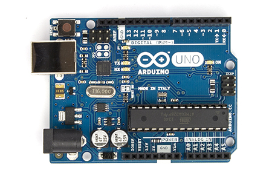
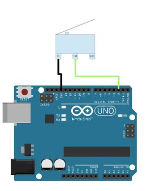
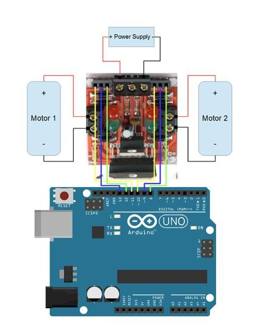

This tutorial covers the basics of different Arduinos, and how to implement common functions with them.

## The Board
The main Arduino boards witnessed being used in these applications are the Arduino Uno and Arduino Mega.

## The Uno


Good for smaller projects
- Has 14 digital input/output pins, 6 analog inputs (which can also be used as digital input/output pins), and a 5v as well as a 3.3v regulator
    - 6 of the digital input/output pins can be used for PWM
    - Pins 2 and 3 are usable for interrupts
    - Pins 0 and 1 cannot be used as normal digital inputs/output pins.
- If you are going to power it externally, you have to use between 7 and 12 volts on the Vin pin, and the ground of your power source has to go to a GND pin. A 9 volt battery works well for this. Make sure you connect the hot to Vin and the ground/negative terminal to ground of the power supply, or else you can fry the board.

## The Mega


Good for bigger projects
- Has 54 digital input/output pins, 16 analog inputs (which can also be used as digital input/output pins), and a 5v as well as a 3.3v regulator
  - 15 of the digital input/output pins can be used for PWM
  - Pins 2, 3, 18, 19, 20, 21 are useable for interrupts.
  - Pins 0 and 1 cannot be used as normal digital inputs/output pins.
- If you are going to power it externally, you have to use between 7 and 12 volts on the Vin pin, and the ground of your power source has to go to a GND pin. A 9 volt battery works well for this. Make sure you connect the hot to Vin and the ground/negative terminal to ground of the power supply, or else you can fry the board.


## Wiring:
### Limit Switch:
#### Example:


Whatever pin that is connected to the Normally Open pin of the limit switch, needs to be setup by using ``pinMode(pin#, INPUT_PULLUP);``

In this example, setup the pinMode as:

``pinMode(2, INPUT_PULLUP);``

In this setup, by using ``digitalRead(pin#)``, if the switch is open, it will read as ``HIGH (1)``, and when the switch is closed, digitalRead will return ``LOW (0)``. This happens because with the ``INPUT_PULLUP`` activated on the pin, it activates a pullup resistor for that pin, which, when the switch is open, the pin gets pulled HIGH by internal circuitry, but when closed, it gets pulled LOW since it is now directly connected to ground.

So to use this intuitively, use ``!digitalRead(pin#);`` this will return HIGH when pressed, and LOW when not pressed.


## Motor Driver:
Example with L298 Compact Motor Driver available in Mechatronics Lab:



With this example, the yellow lines connected to pins 10 and 11 (which are PWM) are the enables for the motors. When the enable is HIGH, the motor is turned on. For PWM lines, you use ``analogWrite(pin#, pwmValue);``, where ``pwmValue`` is an integer between 0-255, with 0 being off, and 255 being always HIGH, with inbetween values able to control speed if your motor is capable of that.

The blue and green lines can be connected to any digital pin, but in this example I kept them grouped. These are the direction pins for the motors. If both are LOW or both are HIGH, the motor will not move. But if direction pin 1 is HIGH and direction pin 2 is LOW, then the motor will move. When direction pin 1 is LOW and direction pin 2 is HIGH, the motor will move in the other direction.

> WARNING: This will send current through the positive node in one orientation, but when the direction is reversed the current will go through the negative node of the motor, make sure you check wiring accordingly

Another thing with this motor driver is that you can either turn off the motor, or you can stall it. Stalling the motor holds the motor taught and doesn't let it move while just turning it off will give play to the motor which is usually undesirable. To stall the motor, set the enable HIGH, and the two direction pins to either LOW or HIGH. To just turn it off, just set the enable to LOW.

Example code:
```
//declare pins
en1 = 11;
dir11 = 12;
dir21 = 13;
en2 = 10;
dir21 = 8
dir22 = 9;

//setup all pins as outputs
setup(){
  pinMode(en1, OUTPUT);
  pinMode(dir11, OUTPUT);
  pinMode(dir12, OUTPUT);
  pinMode(en2, OUTPUT);
  pinMode(dir21, OUTPUT);
  pinMode(dir22, OUTPUT);
}

loop(){
 //spin motors one way at half speed
  analogWrite(en1, 128);
  digitalWrite(dir11, HIGH);
  digitalWrite(dir12, LOW);
  analogWrite(en2, 128);
  digitalWrite(dir21, HIGH);
  digitalWrite(dir22, LOW);
  delay(1000);
 //stall motors
  digitalWrite(en1, HIGH);
  digitalWrite(dir11, HIGH);
  digitalWrite(dir12, HIGH);
  digitalWrite(en2, HIGH);
  digitalWrite(dir21, LOW);
  digitalWrite(dir22, LOW);
  delay(1000);
 //turn motors the other way at 3/4 speed
  analogWrite(en1, 192);
  digitalWrite(dir11, LOW);
  digitalWrite(dir12, HIGH);
  analogWrite(en2, 192);
  digitalWrite(dir21, LOW);
  digitalWrite(dir22, HIGH);
  delay(1000);
 //turn motors off
  digitalWrite(en1, LOW);
  digitalWrite(en2, LOW);
  delay(1000);
}
```
