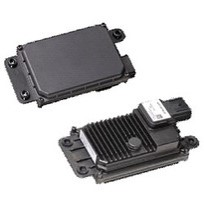
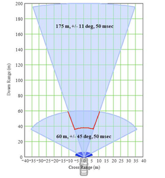

Delphi's multimode Electronically Scanning RADAR (ESR) combines a wide field of view at mid-range with long-range coverage to provide two measurement modes simultaneously. The mid-range coverage (60m, +/-45 deg) not only allows vehicles cutting in from adjacent lanes to be detected but also identifies vehicles and pedestrians across the width of the equipped vehicle. The long-range coverage (175m, +/-11 deg) provides accurate range and speed data with powerful object discrimination that can identify up to 64 targets in the vehicle's path.
Delphi's technologically advanced ESR uses proven solid state technology plus class-leading performance, packaging and durability to offer customers game-changing forward radar detection. The quality of data provided by Delphi's system enables powerful functionality including adaptive cruise control, forward collision warning, brake support and headway alert.

For more introductory information about the sensor and its state-of-the-art technology, please refer to the [official datasheet released by Delphi.](http://cmumrsdproject.wikispaces.com/file/view/delphi_esr_datasheet.pdf/613230495/delphi_esr_datasheet.pdf)

It is always a good idea to study/review some fundamental principles of the radar technology and basic techniques in radar data processing before working on the actual hardware. [This online tutorial](http://www.radartutorial.eu/01.basics/Radar%20Principle.en.html) will offer you the necessary knowledge to build a solid theoretical background for working with the radar hardware.

To get started with the Delphi ESR 2.5 radar, please refer carefully to the instruction in the user manual provided by Delphi.

The data can be acquired from the Delphi ESR 2.5 radar through CAN (Controller Area Network) and/or Ethernet. The raw detection-level data can be obtained through Ethernet, while the raw tracking-level data can be obtained through CAN. In case you need additional assistance on the data acquisition from Delphi ESR 2.5, [AutonomouStuff](https://autonomoustuff.com/product/delphi-esr-2-5-24v/) and [PolySync](http://docs.polysync.io/sensors/delphi-esr-2-5/) also provide generous supports on this specific sensor model, besides the manufacturer Delphi.

References:
1. Delphi ESR Radar Product Page: http://autonomoustuff.com/product/delphi-esr-2-5-24v/
