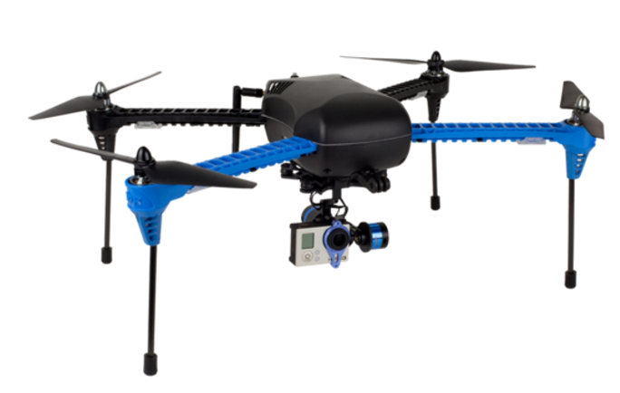
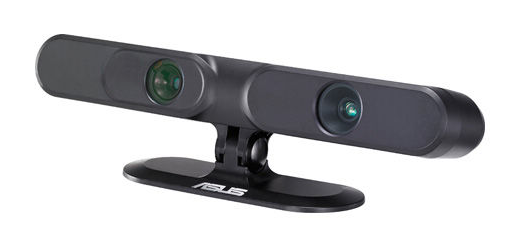
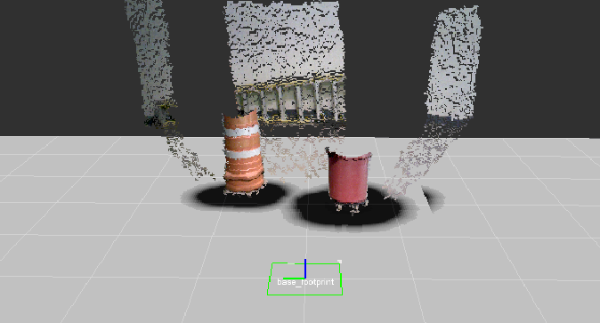

## Package to Use
- ROS Package: http://wiki.ros.org/costmap_2d
- Git Code: https://github.com/ros-planning/navigation/tree/jade-devel/costmap_2d

## When to use this:
You should use this package whenever you want to create a costmap for your robot to navigate through. This package has the ability to use depth sensor information in order to create a costmap with information about obstacles in the map. You can also enter your own cost information in order to specify areas of your map where the robot should not go.

## ROS Interface
The main interface to `costmap_2d` is the object `costmap_2d::Costmap2DROS`. This maintains much of the ROS related functionality and contains `costmap_2d::LayeredCostmap` to keep track of each of the layers. Each layer is instantiated in the Costmap2DROS library using [pluginlib](http://wiki.ros.org/pluginlib) and is added to the `LayeredCostmap`. Layers themselves can be compiled individually, allowing arbitrary changes to the costmap made through the interface `costmap_2d::Costmap2D`.

## Transforms
In order to insert data from sensor sources into the costmap, the object is highly dependent on the [tf package](http://wiki.ros.org/tf) in ROS. This assumes that all transforms between the coordinate frames specified by the `global_frame`, `robot_base_frame`, and sensor sources are connected and up-to-date.

## Subscribed Topics
- `geometry_msgs/Polygon` specification of the footprint of the robot.

## Published Topics
- `nav_msgs/OccupancyGrid` values in the costmap.
- `map_msgs/OccupancyGridUpdate` values of the updated area of the costmap
- `costmap_2d/VoxelGrid` optionally advertised when the underlying occupancy grid uses voxels and the user requests the voxel grid to be published.

## Map Updates
### Updates
The costmap update cycles at the rate specified by the update_frequency parameter.
Each update, the costmap will mark and clear objects.
Costmap automatically subscribes to sensor topics over ROS and updates itself accordingly.
Each sensor is used to:
1. **Mark:** Insert obstacle information into costmap
  - A marking operation is just an index into an array to change the cost of a cell
2. **Clear:** Remove obstacle information from the costmap
  - Raytracing through a grid from the origin to the sensor outwards for each observation reported
3. Both mark and clear

If a 3D structure is used to store obstacle information, obstacle information from each column is projected down into 2D when put into the costmap

### Update Structure
Underlying structure is capable of representing only three different values with each status having a special cost value assigned to it upon projection into costmap:
- Free: `costmap_2d::FREE_SPACE`
  - Columns that have not reached the unknown_threshold parameter are assigned a cost:
- Occupied: `costmap_2d::LETHAL_OBSTACLE`
  - Columns that have a certain number of occupied cells (`mark_threshold` parameter)
- Unknown: `costmap_2d::NO_INFORMATION`
  - Columns that have a certain number of unknown cells (`unknown_threshold` parameter)

## Inflation
Process of propagating cost values from the occupied cells that decrease with distance.
There are five symbols for costmap values defined:
1. **Lethal:** If robot's center were in that cell, the robot would collide with obstacle
2. **Inscribed:** an occupied cell is less than the inscribed radius away from an actual obstacle.
3. **Possibly Circumscribed:** Similiar to **inscribed**, but uses the robot's circumscribed radius as cutoff distance. Could not really be an obstacle cell, but some user-preference that puts a particular cost value into the map.
4. **Freespace:** Assumed to be zero.
5. **Unknown:** No information about cell.

## Setting up the Robot
The following tutorial uses a Quadrotor with RGB-D Sensor as the base platform. The navigation stack has a tutorial for setting up a robot. This tutorial can be found at [Robot Setup Tutorial](http://wiki.ros.org/navigation/Tutorials/RobotSetup).
Here is the setup:

Quadrotor (`base_link`): [3DR Iris+](https://store.3dr.com/products/IRIS)


Depth Sensor (`camera_link`): [Xtion Pro Live](https://www.asus.com/us/3D-Sensor/Xtion_PRO_LIVE/)


### Setup of the camera
The Xtion Pro Live is a sensor made by Asus. It is a structured light stereo camera that is able to generate 3D point clouds indoors. If you want to read more about structured light cameras, here is a link to [the Wikipedia page](https://en.wikipedia.org/wiki/Structured-light_3D_scanner). [This paper](http://fofi.pagesperso-orange.fr/Downloads/Fofi_EI2004.pdf) that covers the general methods of structured light cameras. The Asus Xtion Pro Live is able to provide RGB and depth data. This data needs to be manipulated by a package that is able to handle point cloud information. OpenNI is a convenient package that is able to handle complicated camera sensor data and suited for this purpose.

The command to download OpenNI binaries to Ubuntu the command in the command line is:
```
$ sudo apt-get install ros-indigo-openni2-launch
```

This will download a package that is able to communicate camera information through ROS. The OpenNI package documentation can be found [here](http://wiki.ros.org/openni_launch). Once the camera has been setup, you can get the camera information with the following ROS command:
```
$ roslaunch openni2_launch openni2.launch depth_registration:=true
```

This command runs the `openni2.launch` file. In order to get the depth information, we need to have the depth information published. This is where the `depth_registration:=true` command comes in. `depth_registration` allows to have more consistent depth information published. It publishes them on a separate ROS topic.

### Setup the Transforms
The navigation stack requires two very important things:
1. A point cloud
2. Appropriate transforms

There are two specific transforms that the navigation stack requires:
1. `map` (Global frame) -> `base_footprint` (Robot body frame)
2. `base_footprint` (Robot body frame) -> `camera_link` (Camera body frame)

This then gives us a transform between the global frame and the camera frame. The `camera_link` frame should also have the transforms between the `camera_link` frame and the lens frame. When using an RGB-D sensor like the Asus Xtion Pro Live, there are two different lens frames (one for each lens in a stereo camera). Luckily, by running the `openni2.launch` file, the transforms from the two different lenses to the `camera_link` frame are being published automatically. Thus, we only need to get the transform from the `map` to the `base_footprint` frame and the `base_footprint` to the `camera_link`.

The transformation between the `map` and `base_footprint` is fairly arbitrary. It all depends on where you want to set the origin of the global frame to be. There are two ways that we considered doing this:
1. Set the origin of the global frame to be (0,0,0,0,0,0,0) = (x,y,z,Quat(1x4))
2. Set the origin to be the original pose that the robot was whenever the node was run.

For our purposes, we will use the latter. The source code for this approach can found [here](https://github.com/ColumnRobotics/column/blob/SLAM_stuff/src/pose_tf.cpp).
The code is a publisher-subscriber function that subscribes to the odometry information from the quadrotor (through `mavros` from the PIXHAWK flight controller).

The first time it is run, it sets the first pose that the robot was found in at the beginning of the node's run. It then published the transform as the difference between the original pose and the new pose. One thing that is worth noticing is that we always set the Z direction to be zero. This is due to the fact that the cost map is a 2D costmap and is made for a ground robot. The navigation stack is not designed to work with robots that can fly. The costmap can still be effective, but can only be considered as a 2D map.

Broadcasting a transform is a simple procedure in ROS. All transforms that are broadcast are also published to the `\tf` topic so that you can visualize them in [rviz](http://wiki.ros.org/rviz).

You can also publish a static transform which broadcasts a transform continuously. This can be done on the command line or through a launch file. An example of the line in a launch file to publish a static transform is shown below.
```
	<node pkg="tf" type="static_transform_publisher" name="camera_to_base" args="0 0 0 0 0 0 /base_footprint /camera_link 100"/>
```

Let's dissect this:
- The `pkg="tf"` specifies the ROS package that is being run. This is the tf package in ROS.
- The `type="static_transform_publisher"` part specifies the node in the tf package to be run. This is the static transform node that constantly publishes a single transform that doesn't change.
- The `name="camera_to_base"` does not affect performance, but it provides a name that can help in debugging.
- The major part of the code is the `args` part. There are two ways to specify the arguments. You can either specify 6 or 7 initial arguments.
  - If you choose 6 you must specify `(x,y,roll,pitch,yaw)`.
  - If you specify 7 you must specify `(x,,y,Quaternion(1x4))`.
  - Remember that this is the transformation between two frames, so you must specify the transform and not the frames themselves.
- The next two arguments (here `/base_footprint` and `/camera_link`) specify the transformation as `/parent_frame` `/child_frame`.
- The final argument is the rate to be published.

If you wanted to go with the origin at (0,0,0,0,0,0,0) there is an easy way to do this in [MAVROS](http://wiki.ros.org/mavros). MAVROS is a ROS wrapper for [MAVlink](https://en.wikipedia.org/wiki/MAVLink) which is a communication protocol that the PIXHAWK flight controller uses. In order to get mavros, you can run the following command in your terminal:
```
$ sudo apt-get install ros-indigo-mavros`
```
Once mavros is installed, you can run mavros with two different commands depending on which version of the flight controller firmware you are running: [PX4](http://dev.px4.io/) or [APM](http://ardupilot.org/ardupilot/index.html).
- PX4: `$ roslaunch mavros px4.launch`
- APM: `$ roslaunch mavros apm.launch`

The PX4 firmware stack is the one recommended, because it is made for developers unlike the APM planner which is designed for products. The Iris+ originally came with the APM firmware, but it is quite an easy shift to the PX4 firmware. If you are running the PX4 firmware, you can change the config file in your MAVROS folder in order to have it publish the transforms that you want. You can get to this file by running the command:
```
$ roscd mavros
```
The source code for MAVROS, which will be similar to the folder you will find by running the above command can be found at this [link](https://github.com/mavlink/mavros/tree/master/mavros/launch).

You will want to find the file named `px4_config.yaml` or `apm_config.yaml` depending on which of the flight controller firmware you are running. If you are running the PX4 firmware, you are going to want to open `px4_config.yaml` and find this section:


Once you find it, you will want to change:
- `frame_id: "local_origin"` to `frame_id: "map"`
- `child_frame_id: "fcu"` to `child_frame_id: "base_footprint"`
- `send: false` to `send: true`

This will get MAVROS to publish the frames correctly, and you will have the correct transformation between `map` and `base_footprint`.

You can find the transform between `base_footprint` and `camera_link` yourself and use the static publisher `.launch` file to publish a single transform. If your camera is attached to the base, you can just find the (x,y,roll,pitch,yaw) between the frames. Once you have these, you can then just change the arguments and all of your transforms will be broadcast correctly.

Now that we have the transforms correct and the depth information publishing, we can begin to start looking at the navigation stack configuration files.

## Setting up the cost map configuration files
This again comes from the navigation stack setup [robot tutorial](http://wiki.ros.org/navigation/Tutorials/RobotSetup) that we mentioned earlier. I will explain how we set these configuration files up for our robot.

### Common costmap configs
The link to our paramaters file can be found [here](https://github.com/ColumnRobotics/column/blob/SLAM_stuff/costmap_common_params.yaml).

The following part of the code describes to the costmap the footprint of the robot. It will be centered on the base_footprint frame and will extend to the footprint that you specify below in meters. The padding will specify if you want to create a little bit of a cushion between your footprint and the obstacles. The footprint should be calculated yourself and is very important. It will tell the planner of collisions. The inflation radius determines how much the obstacle is inflated. This is discussed in the inflation section above.
```
footprint:[[ 0.3, 0.3], [-0.3, 0.3], [-0.3, -0.3], [ 0.3, -0.3]]
footprint_padding: 0.03
inflation_radius: 0.55
```

The next part is the most important as it will cause the costmap to fail if not specified correctly. We must tell the navigation stack which topic to listen to for the point cloud information. We must also specify the type of the source so that it knows how to handle it.
```
observation_sources:point_cloud_sensor

point_cloud_sensor:{sensor_frame: camera_rgb_frame, data_type: PointCloud2, topic: /camera/depth_registered/points, marking: true, clearing: true}
```
We are using an RGB-D sensor, and so we supply it with `point_cloud_sensor` for the `observation_sources` parameter.

The next section defines the `point_cloud_sensor`. We must specify the frame that we are looking in. This frame should be the frame that the point cloud information is in. We get this frame from the tf information that is posted by OpenNI. The data type is PointCloud2. We can find this by running the command
```
$ rostopic info
```
On the topic that is publishing the point cloud information.

### Local and global costmap configs
These configuration files are more self-explanatory and are found here:
- [local_costmap_params.yaml](https://github.com/ColumnRobotics/column/blob/SLAM_stuff/local_costmap_params.yaml)
- [global_costmap_params.yaml](https://github.com/ColumnRobotics/column/blob/SLAM_stuff/global_costmap_params.yaml)

### Move Base Launch File
The launch file that we use, `move_base.launch`, is found [here](https://github.com/ColumnRobotics/column/blob/SLAM_stuff/launch/move_base.launch).

The early parts of the file are not informative and are setting up the transforms that I mentioned earlier. The bottom part is what you need to run:
```
<!-- Move Base Package -->
<node pkg="move_base" type="move_base" respawn="false" name="move_base" output="screen">

<rosparam file="$(find column)/costmap_common_params.yaml" command="load" ns="global_costmap" />

<rosparam file="$(find column)/costmap_common_params.yaml" command="load" ns="local_costmap" />

<rosparam file="$(find column)/local_costmap_params.yaml" command="load" />

<rosparam file="$(find column)/global_costmap_params.yaml" command="load" />

</node>
```
### How to run the setup
In order to run the setup you must first run OpenNI in order to get your transforms from the lenses to `camera_link`. And then you must publish the transform from the map to the `base_transform` and the `base_transform` to the camera_link.

Our setup can be run by issuing the following commands in separate terminals or in a bash script.
```
$ roslaunch openni2_launch openni2.launch depth_registration:=true
$ roslaunch mavros px4.launch
$ roslaunch column move_base.launch
```
### Output
The output of the costmap is shown here.


## Communications with PIXHAWK
The APM firmware stack is not as powerful as the PX4 firmware. In order to get communication from the PIXHAWK flight controller to the onboard computer you need to use the Telem 1 or Telem 2 port to transfer information through UART. More information can be found [here](http://ardupilot.org/copter/docs/common-telemetry-port-setup-for-apm-px4-and-pixhawk.html). You can also transfer through USB, which is often unreliable, however.
